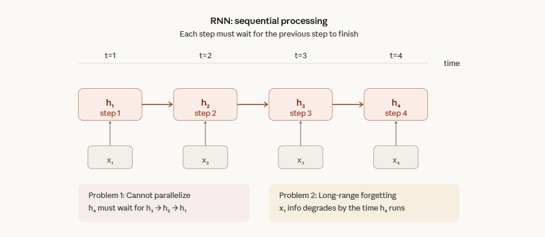
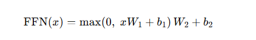
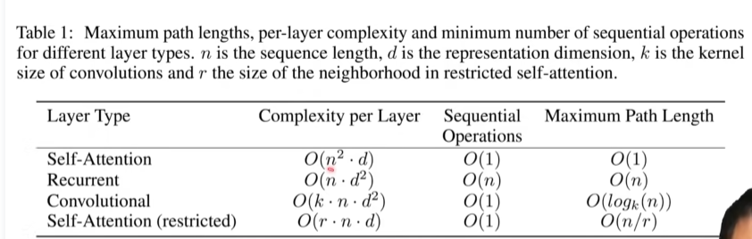
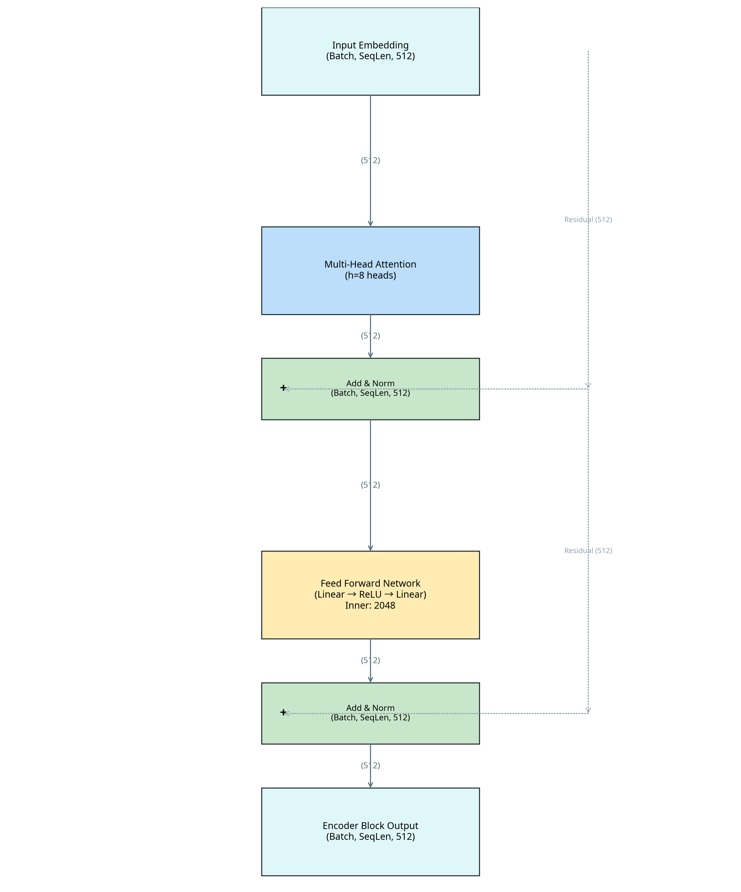

## 核心四问

**什么是Transformer？**

Transformer就是一个基于自注意力机制和多头注意力机制的注意力架构，他可以被实例为仅编码器（BERT），也可以是仅解码器（GPT）也可以是编码器-解码器（T5）。

| 问题 | 内容 | 页码 |
|------|------|------|
| **解决什么问题？** | RNN/LSTM的序列计算依赖导致并行困难，长距离依赖捕捉差 | Sec 1 |
| **核心创新点？** | 完全基于Self-Attention的Encoder-Decoder架构，无需循环即可并行训练 | Abstract |
| **如何证明有效？** | WMT 2014英德翻译BLEU 28.4（SOTA），英佛BLEU 41.8；训练速度大幅快于GNMT | Sec 5 |
| **代价与局限？** | O(n²)复杂度限制长序列；小数据集表现不如LSTM；位置编码外推性有限 | Sec 6 + 个人观察 |

**关于RNN的问题：**

RNN的架构是计算从左往右一个序列一个序列去做，假设是序列一个句子，就是从左往右一个词一个词看，对第t个词，他的输出叫 $h(t)$。



---

## Attention 注意力机制

注意力机制就是每个词在处理自己的时候，去看一眼别的词里，谁跟自己最相关（most relevant），然后重点参考那些词（then focus on those words）。

> Attention is: every word computing itself and look up other word, find out which is the most relevant word then focus on those words.

公式：


**举例理解：**

> The animal didn't cross the street because it was too tired.

这里的 `it` 到底指谁？模型看到 `it` 的时候，不能只看它自己，得回头看前面哪些词更相关。它可能会发现：`animal` 跟 `it` 更像一回事，于是就重点参考 `animal`。这就是"注意力"——不是平均看所有词，而是更关注那些和当前词有关的词。

**Query / Key / Value 是什么：**

- **Query（查询）**：我现在想找什么
- **Key（关键词/标签）**：我这里能提供什么线索
- **Value（内容）**：我真正携带的信息是什么

**Softmax 是激活函数的一种：** 它会把一组任意实数，变成每一项都大于 0、所有项加起来等于 1，所以看起来就像"概率分布"。

**Mask 的作用：** Transformer中的 $q_t$、$k_t$，t 时间以外的 q、t 会加个 mask，这个 mask 在 softmax 中加了个很大的负数。该 mask 的本质作用是：不让当前位置偷看未来，防止未来信息泄露。

---

## 技术解剖

### 3.1 架构要点

#### Multi-Head Attention

将 Q/K/V 投影到 h 个子空间并行计算，拼接后线性变换。多头注意力机制简单来说，就像是有多个观察员去观察一个对象。

> **注意：** Encoder 和 Decoder 的多头注意力机制是不同的。Decoder 涉及到 masked-multi-head attention，mask 会给时间 t 之后的序列加上一个很大的负数，导致之后为 0。

#### Scaled Dot-Product

除以 √d_k 防止 softmax 梯度消失（当 d_k 较大时点积方差大）。

简单来说，除以根号 d_k 是为了防止进入 softmax 函数的输入分布过大，如 `[15, 1, -10086]` → `[1, 0, 0]`，使 softmax 输出过于极端，避免某个位置权重几乎变成 1、其他位置几乎变成 0，从而造成梯度过小、训练不稳定。

#### Embedding and Softmax

正常来说，输入的是一个个词元/token，需要把 token mapping to 向量。Embedding 就是给定任何一个词，学习一个长为 d 的向量去表示它。

**为什么 Embedding 这里要乘根号 d？**

Embedding 矩阵通常用均值为 0、方差较小的随机值初始化（比如方差约 1/d_model），这意味着每个 embedding 向量的每个分量值都很小。维度 d_model=512 时，向量的 L2 范数大约在 1 左右。

但问题是，Transformer 里 Embedding 和 Positional Encoding 是直接相加的。Positional Encoding 用的是 sin/cos 函数，每个分量的值域是 [-1, 1]，整个向量的 L2 范数大约在 √(d/2) 量级。如果 d=512，positional encoding 的范数大约在 16 左右，而 embedding 的范数才 1 左右——位置信息会完全淹没语义信息。

乘以 √d_model 之后，embedding 向量的范数也被拉到 √d 量级，这样两者相加时处于同一个尺度，语义和位置信息都能被有效保留。

另外一层考虑是跟 Attention 的 √d_k 缩放保持数值一致性。论文里 Embedding 权重矩阵和最后 Softmax 前的线性变换是共享的（weight tying），这个缩放因子确保了共享权重在两个用途下的数值尺度都是合理的。

> **简单来说：不乘 √d，embedding 的值太小，加上 positional encoding 后语义信息就被位置信息盖掉了。**

#### Positional Encoding

使用 sin/cos 而非可学习参数，为了外推长序列（但绝对位置编码有局限）。

你可以把它想成：词向量告诉模型"这是 apple"，位置编码告诉模型"它在第 5 个位置"。两者相加后，模型看到的就不是单纯的 apple，而是"位于第 5 个位置的 apple"。这样 attention 在计算时，就不只是看"谁和谁语义像"，还会隐含地知道"谁在前，谁在后，谁离谁近"。

> **为什么要这样处理：** 因为 Attention 自身不带顺序感，只有 RNN 这种串行的神经网络才自带顺序感。

#### Position-Wise Feed-Forward Network


对序列里的每一个位置，单独做一遍同样的两层全连接变换。

公式：



**为什么叫 position-wise？**

因为它是对每个位置分别做的。假设一句话经过 attention 后，得到第1个位置一个向量、第2个位置一个向量、第3个位置一个向量。FFN 做的事情不是让这些位置再互相交流，而是每个位置自己过一遍同样的 MLP（多层全连接网络 Multi-Layer Perceptron）。

> MLP：把一个向量丢进几层线性变换和激活函数里，做一次非线性加工。

**FFN 和 Attention 的区别：**

- **Attention 负责：** 让一个位置去看别的位置，做信息混合——"收集信息"
- **FFN 负责：** 把当前位置已经聚合到的信息，再做一次非线性加工——"深加工信息"

**为什么 Transformer 里需要 FFN？**

因为 attention 本质上更像一种加权汇总机制，本身表达变换能力有限。如果只有 attention，没有后面的 FFN，模型每个位置拿到信息后，处理能力会不够强。FFN 的作用是提升表达能力、加入非线性、对每个位置的表示做进一步特征变换。

#### Self-Attention

同样一个东西，它本身既作为 query 又作为 key 又作为 value。

**举例：** "我 / 喜欢 / 学习 / Transformer"。在 self-attention 中，这句话本身生成 Q，本身生成 K，本身生成 V。通俗来讲：句子里的词，拿自己这句话里的信息，去关注这句话里的其他词。

**注意：** 假设输入是 X，QKV 会做三次不同的线性变换：

```math
Q = XW_Q, \quad K = XW_K, \quad V = XW_V
```

来源同一个，但是变换出来的 QKV 不一定完全相同，因为它们乘了不同的参数矩阵。Self-attention 的 "self" 指的是 Q、K、V 都来自同一个序列，而不是来自两个不同序列。输入是同一个来源，但不等于完全同一个向量。

### 3.2 关键超参

| 超参 | 值 | 备注 |
|------|------|------|
| d_model | 512 | 模型维度 |
| n_heads | 8 | d_k = d_v = 64 |
| Dropout | 0.1 | |
| Label Smoothing | 0.1 | 重要细节，影响收敛 |

---

## 实验洞察

**关于 Attention 的核心理解：**

Attention 的核心就是"用 Query-Key 算权重，对 Value 做加权和"；但权重不是对象单方面决定，而是由对象之间的匹配关系决定。即输出就是输入的加权和，权重由向量和其他向量的相似度决定。

**关于 Multi-Head Attention 的核心理解：**

在 multi-head attention 中，每个头先投影，再算注意力。即不是先分头再随便算，而是先把输入投影成各头自己的 Q/K/V，然后每个头在自己的子空间里做注意力。

### 3.3 训练细节（Sec 5.1 - 5.3）

**数据集：**

| 任务 | 数据集 | 规模 | 词表 |
|------|--------|------|------|
| 英→德 | WMT 2014 EN-DE | 450万句对 | BPE, 37000 tokens |
| 英→法 | WMT 2014 EN-FR | 3600万句对 | Word-piece, 32000 tokens |

**硬件与训练时间：**

| 模型 | 硬件 | 每步耗时 | 总步数 | 总训练时间 |
|------|------|----------|--------|------------|
| Base | 8× P100 | 0.4秒 | 100K步 | 12小时 |
| Big | 8× P100 | 1.0秒 | 300K步 | 3.5天 |

> **关键洞察：** 3.5天、8张卡就能训出当时的 SOTA。对比同期的 GNMT（Google的RNN翻译系统），Transformer 训练成本只有它的 1/4 甚至更少。这不是微小的改进，是数量级的效率提升。这也是为什么 Transformer 能迅速统治 NLP——不只是效果好，而是又好又便宜。

**优化器设置：**

使用 Adam 优化器，β₁=0.9，β₂=0.98，ε=10⁻⁹。学习率用了一个特殊的 warmup schedule：前 4000 步线性增大，之后按步数的平方根倒数衰减。

> **为什么要 warmup？** 训练初期模型参数是随机的，梯度方向不靠谱。如果一开始就用大学习率，模型会"乱跳"，可能直接崩掉。先用小学习率让模型"找到方向"，再逐渐加大步伐，最后慢慢减速精调。这个 warmup 策略后来成了训练大模型的标配。

**正则化：**

- **Dropout = 0.1**：在每个子层的输出、attention 权重、embedding 相加处都加了 dropout
- **Label Smoothing = 0.1**：不给正确答案 100% 的概率，而是给 90%，剩下 10% 均匀分给其他词。这会让模型的 perplexity 变差（因为模型变得"不那么自信"），但 BLEU 分数反而变好（因为翻译的多样性更好，不会死板地只输出一个词）

> **Label Smoothing 的直觉：** 就像考试时，老师告诉你"答案A大概率对，但BCD也不是完全不可能"，这会让你学得更灵活，而不是死记硬背。

### 4.0 主实验结果（Table 2）

**性能表**: 

| 模型 | EN→DE BLEU | EN→FR BLEU | 训练成本 (FLOPs) |
|------|------------|------------|------------------|
| 之前 SOTA (ensemble) | 26.36 | 41.29 | 极高 |
| Transformer Base | 27.3 | 38.1 | 3.3×10¹⁸ |
| Transformer Big | **28.4** | **41.8** | 2.3×10¹⁹ |

> **这张表的核心信息：** Transformer Big 在英→德上超过之前最好的 ensemble（多个模型集成）2个 BLEU 点——注意对方是多个模型加在一起，Transformer 是单个模型。在英→法上也刷新了单模型 SOTA。而且训练成本远低于之前的系统。Table 1 的理论预测（并行度高→训练快）在这里被实验数据完全验证了。

### 4.1 关键消融（Table 3）

- **参数量**：大模型效果好，但 Attention heads 数量影响小于层数
- **Attention 变体**：Additive Attention（Bahdanau）vs Dot-Product，后者更快且效果相当（当 d_k 较小时）

**Table 3 逐行解读：**

**(A) 注意力头数量的影响：** 保持总计算量不变，改变 head 数。单头（h=1）比最优设置差 0.9 BLEU。但头数太多（h=32，此时 d_k=16）效果也会下降。说明每个头的维度不能太小，否则"每个观察员能看到的信息太少"，注意力质量下降。

**(B) d_k 的影响：** 减小 attention key 的维度会损害模型质量。说明用点积来判断"谁跟谁相关"这件事并不简单，给它足够的维度很重要。

**(C)(D) 模型大小和 Dropout：** 更大的模型（更多层、更宽）效果更好，dropout 对防止过拟合非常关键。

**(E) 位置编码：** 把 sin/cos 替换成可学习的 positional embedding，效果几乎一样。说明位置编码的具体形式不是关键，关键是"要有位置信息"这件事本身。

> **消融实验的阅读方法：** 不要只看"哪个最好"，要看"去掉什么会变差"。变差最多的那个组件，就是整个架构里最不可或缺的部分。从 Table 3 来看，d_k 太小和单头注意力是伤害最大的，说明"多头 + 足够维度"是 Transformer 的核心。

### 4.15 泛化能力验证（Table 4 — English Constituency Parsing）

论文不只测了翻译，还测了英语句法分析（constituency parsing）。这个任务是把一句话解析成语法树结构，跟翻译完全不同。

结果：Transformer 在没有做任何任务特定调优的情况下，效果超过了几乎所有之前的专用模型（除了 RNNG）。甚至在只用 4万句 WSJ 训练集训练时，也超过了 BerkeleyParser。

> **这个实验为什么重要？** 它暗示了 Transformer 不只是一个翻译模型，而是一个通用的序列处理架构。这为后来 BERT、GPT 的出现埋下了伏笔——如果 Transformer 连句法分析都能做好，那它是不是什么 NLP 任务都能做？事实证明确实如此。

Complexity per Layer（每层计算量）
Self-Attention 是 O(n²·d)，Recurrent 是 O(n·d²)。关键在于 n 和 d 谁大——论文当时处理的典型场景下，序列长度 n 通常几十到几百，而 d=512。所以大多数情况下 n < d，Self-Attention 反而比 RNN 更便宜。但这也暴露了 Transformer 的致命弱点：一旦 n 很大（长文档、代码），n² 项就会爆炸，这正是后来 FlashAttention、Ring Attention 要解决的问题。

Sequential Operations（串行步数）
这是 Transformer 最大的卖点。Self-Attention 是 O(1)——整个注意力矩阵可以用一次矩阵乘法并行算完。而 Recurrent 是 O(n)，必须一步一步串行走。这直接决定了训练速度：同样的数据，Transformer 能把 GPU 喂满，RNN 只能一个时间步一个时间步等。论文实验里训练速度的巨大差距，根源就在这一列。

Maximum Path Length（最大信息路径）
这列解释了为什么 Transformer 能更好地捕捉长距离依赖。Self-Attention 里任意两个 token 之间路径长度是 O(1)——一步直达。RNN 是 O(n)，信息从第1个词传到第100个词要经过99次传递，每次都有信息衰减。这就是你前面笔记里写的"长距离遗忘"问题的理论根据。
论文没直接说但暗含的权衡逻辑是这样的：

RNN 在计算量上对 n 友好（O(n·d²) 对 n 是线性的），但串行和路径长度都拉垮了。Convolutional 串行步数也是 O(1)，但路径长度是 O(log_k(n))，不如 Self-Attention 的 O(1) 干净。所以 Self-Attention 是唯一一个同时做到"完全并行 + 路径最短"的架构，代价是 n² 的计算复杂度。

论文的潜台词很明确：对于当时主流的序列长度，这个代价完全值得。整篇论文后续的实验本质上都是在验证这张表的预测——训练更快（第二列）、效果更好（第三列），复杂度在可接受范围内（第一列）。

### 4.2 负面结果（Sec 6）

- 在小数据集（如 IWSLT）上 Transformer 不如 LSTM，可能需要强正则化或架构调整

---

## 论文树定位

### 5.1 上游

- Sequence to Sequence Learning (Sutskever et al., 2014)
- Neural Machine Translation with Attention (Bahdanau et al., 2015)

### 5.2 下游（待读）

- **BERT** (Encoder-only) — Devlin et al., 2019
- **GPT** (Decoder-only) — Radford et al., 2018
- **FlashAttention** (解决O(n²)内存墙) — Dao et al., 2022
- **RoPE** (改进位置编码) — Su et al., 2021

### 5.3 与我方向的关联

- 我的课题涉及长上下文微调，需注意 O(n²) 复杂度问题，后续必读 FlashAttention 和 Ring Attention
- 当前在阶段A，需先理解 Attention 机制再深入 LoRA 微调（阶段B）

---

## 实现线索

- **PyTorch 参考**：`torch.nn.MultiheadAttention` 源码（注意 `bias=False` 的设置）
- **Hugging Face**：`modeling_bert.py` 中的 `BertSelfAttention` 实现（基于本文的变体）
- **复现难点**：确保 Positional Encoding 的 sin/cos 公式与论文完全一致；注意 LayerNorm 在 Pre/Post 的位置（原论文是 Post-LN，现代实现多用 Pre-LN 更稳定）

---

## 批判性思考

**潜在问题：**

- 论文报告的是最大模型结果，但未详细讨论训练不稳定问题（后续工作表明大 Transformer 对初始化和学习率很敏感）
- 位置编码的周期性假设对某些任务（如代码生成）可能不是最优

**后续改进想法：**

- 将绝对位置编码替换为 RoPE，观察长序列外推性
- 尝试在阶段C将此架构与 DeepSpeed ZeRO 结合训练大模型

---

## 读后行动计划

### 第一步：手推核心公式（1天）

拿纸笔，从头推一遍以下内容，不看笔记：

1. 给定输入矩阵 X (shape: n×d)，写出 Q、K、V 的计算
    Answer:
    ```math
    Q = XW_Q,\quad K = XW_K,\quad V = XW_V
    ```
    
    ```math
    Q \in \mathbb{R}^{n_q \times d_k},\quad K \in \mathbb{R}^{n_k \times d_k},\quad V \in \mathbb{R}^{n_k \times d_v}
    ```
            
2. 写出 Scaled Dot-Product Attention 的完整公式，解释每一步的 shape 变化
    Answer:
    ```math
    \mathrm{Attention}(Q,K,V)=\mathrm{softmax}\left(\frac{QK^\top}{\sqrt{d_k}}\right)V
    ```
    
    首先第一步做线性变换，得到 `Q ∈ R^(n_q × d_k)`，`K ∈ R^(n_k × d_k)`。转置后 `K^T ∈ R^(d_k × n_k)`，所以 `QK^T ∈ R^(n_q × n_k)`。除以 `sqrt(d_k)` 后 shape 不变，做 `softmax` 后 shape 还是不变。再乘 `V ∈ R^(n_k × d_v)`，所以整个 Attention 的输出 shape 是 `R^(n_q × d_v)`。
3. 写出 Multi-Head Attention 的拼接和线性变换，算清楚参数量
   Answer:
   这道题最容易记的思路就是：**3 个投影 + 拼接 + 1 个输出投影**。

   设输入为：
   ```math
   X \in \mathbb{R}^{n \times d_{model}}
   ```
   论文里的设定是：

   - `d_model = 512`
   - `h = 8`
   - `d_k = d_v = 64`

   因为 `512 ÷ 8 = 64`。

   第 i 个头先做三次线性变换：
   ```math
   Q_i = XW_i^Q,\quad K_i = XW_i^K,\quad V_i = XW_i^V
   ```

   其中
   ```math
   W_i^Q,\ W_i^K,\ W_i^V \in \mathbb{R}^{512 \times 64}
   ```
   所以每个头算完 attention 后得到：
   ```math
   \mathrm{head}_i \in \mathbb{R}^{n \times 64}
   ```

   然后把 8 个头拼接起来：
   ```math
   H=\mathrm{Concat}(\mathrm{head}_1,\dots,\mathrm{head}_8)
   ```
   
   因为是把 8 个 `n × 64` 横着拼起来，所以
   ```math
   H \in \mathbb{R}^{n \times (8 \cdot 64)}=\mathbb{R}^{n \times 512}
   ```

   **注意：Concat 本身没有参数，它只是把结果拼起来。**

   拼接后再做一次输出线性变换：
   ```math
   \mathrm{MultiHead}(X)=HW^O
   ```
   
   其中
   ```math
   W^O \in \mathbb{R}^{512 \times 512}
   ```
   所以最终输出还是
   ```math
   \mathrm{MultiHead}(X)\in\mathbb{R}^{n \times 512}
   ```

   参数量只来自 **Q、K、V 三个投影矩阵** 和 **最后一个输出投影矩阵**：

   - 每个头的 Q/K/V 参数量：`3 × 512 × 64`
   - 8 个头一共：`8 × 3 × 512 × 64`
   - 输出投影参数量：`512 × 512`
   - 总参数量：
     ```math
     8 \times 3 \times 512 \times 64 + 512 \times 512 = 1,048,576
     ```

   也可以直接记成：
   ```math
   \text{Multi-Head Attention 参数量} = 4d_{model}^2
   ```
    
   本题中
   ```math
   4 \times 512^2 = 1,048,576
   ```

   **一句话记忆：** Multi-Head Attention 就是先做 Q/K/V 三个投影，每个头各算各的 attention，拼接后再做一个输出投影；拼接没有参数，所以总共就是 **3 个投影 + 1 个输出投影**。
    
4. 画出一个完整的 Encoder block（Attention → Add & Norm → FFN → Add & Norm），标注每一步的输入输出维度
    Answer: 
> **检验标准：** 能不能不看任何资料，在白纸上画出完整的 Encoder block 并标注所有维度？如果画不出来，说明还没真正理解。

### 第二步：代码复现 Scaled Dot-Product Attention（1-2天）

用 PyTorch 从零实现，不调用 `torch.nn.MultiheadAttention`：

- [ ] 实现 `scaled_dot_product_attention(Q, K, V, mask=None)`
- [ ] 实现 `MultiHeadAttention` 类（包含投影矩阵和输出线性层）
- [ ] 写测试：随机输入，验证输出 shape 正确、attention weights 的每行 sum=1
- [ ] 加上 mask，验证 decoder 的 causal mask 是否正确屏蔽了未来信息

> **推荐参考：** Harvard 的 "The Annotated Transformer"（带注释的逐行实现），但先自己写，卡住了再看。

### 第三步：精读一篇下游论文（2-3天）

从下游论文里选一篇读，建议按这个优先级：

1. **GPT-1**（Radford et al., 2018）—— 如果你的方向偏生成/Decoder-only，先读这篇。它展示了 Transformer Decoder 如何做预训练+微调，是理解 GPT 系列的基础
2. **BERT**（Devlin et al., 2019）—— 如果你的方向偏理解/Encoder-only，读这篇。它展示了 Transformer Encoder 如何做双向预训练

> **读下游论文的目的：** 反过来加深对 Transformer 的理解。读完 GPT 你会更清楚为什么 Decoder 需要 mask；读完 BERT 你会更清楚为什么 Encoder 不需要。

### 第四步：把笔记升级为"可教别人"的版本（1天）

> 费曼学习法：如果你不能简单地解释一个东西，说明你没有真正理解它。

尝试写一篇 2000字左右的文章（可以发公众号或知乎），用大白话给一个完全不懂 AI 的人解释 Transformer。写的过程中你会发现自己哪些地方是"假懂"——知道公式但说不清直觉。这些地方就是需要回去补的。
