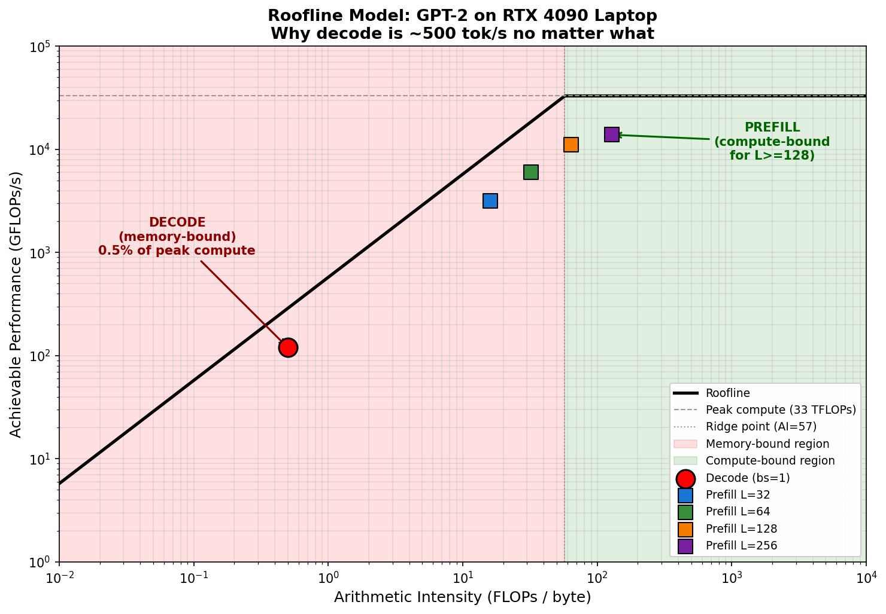
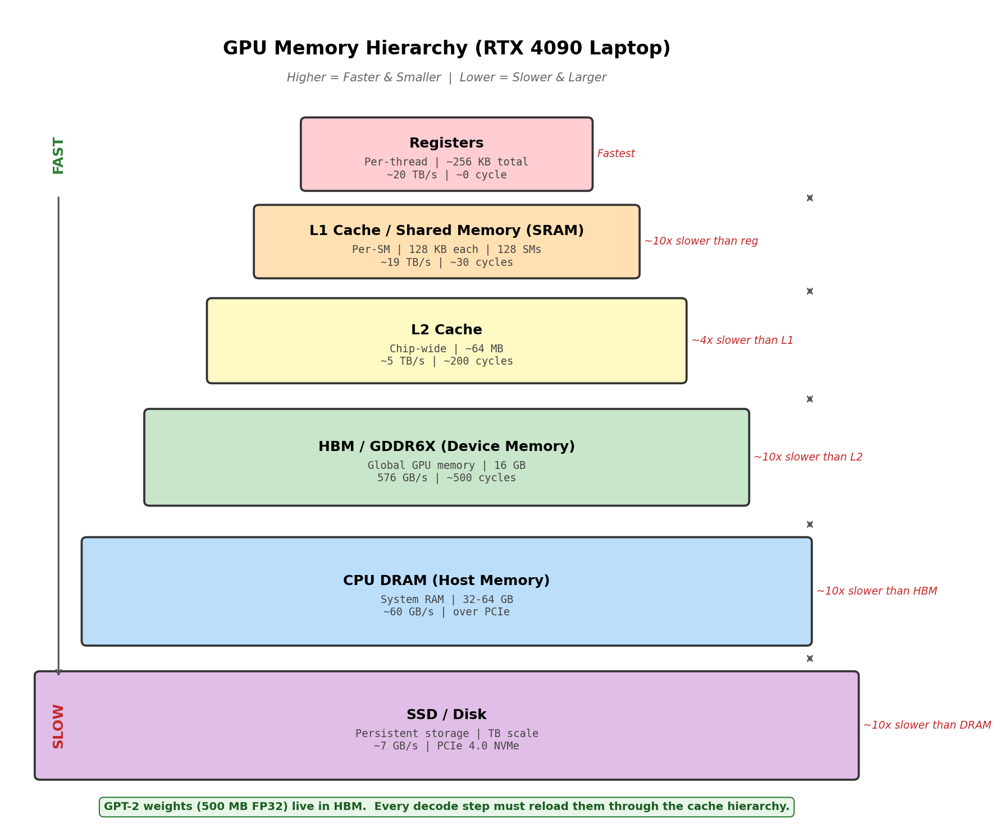
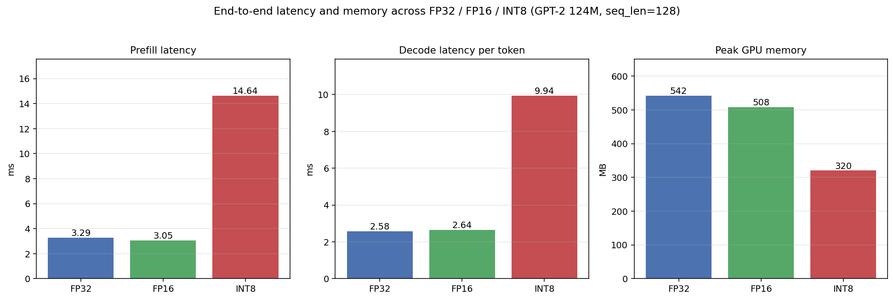
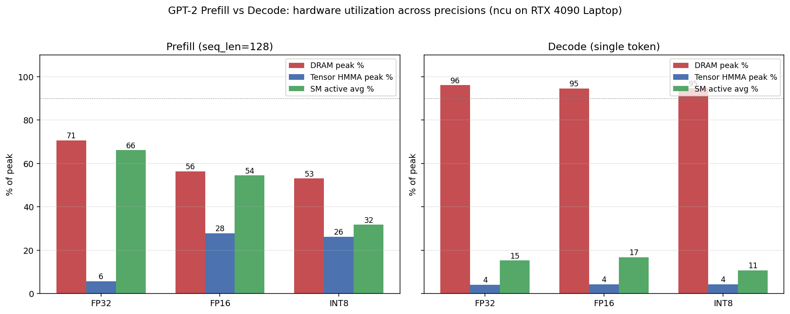

# llm-inference-study

> A hands-on study of LLM inference performance — from Transformer internals to deployment.
> Built from scratch on a single RTX 4090 Laptop (16 GB GDDR6X). Reproducible benchmarks, FastAPI serving, Docker.


---

## TL;DR — Three Findings That Drove Every Design Decision

| Finding | Number | Implication |
|---|---:|---|
| Decode dominates total inference time | **96.7 – 98.2 %** | Optimization must target decode, not prefill |
| Decode arithmetic intensity vs RTX 4090 ridge point | **0.5** vs **57.3** FLOPs/byte | Decode is **115× below** the compute roof — pure memory-bound |
| Decode real FLOPs utilization | **0.36 %** | The GPU spends 99.6 % of decode time waiting on HBM, not computing |

**Conclusion:** Switching precision (FP16/INT8) cannot fix decode latency on its own.
The only way out is to **raise arithmetic intensity** — via KV cache, batching, and serving-level tricks.

This is exactly what the project builds out, week by week.

---

## Visual Summary

| | |
|---|---|
|  |  |
| **GPT-2 on RTX 4090 Laptop Roofline** — decode sits 115× below the ridge point. | **GPU memory hierarchy** — why HBM bandwidth, not FLOPs, is the bottleneck. |
|  |  |
| **FP32 vs FP16 vs INT8** — precision alone barely moves decode latency. | **NCU SM / memory utilization** — confirms the memory-bound diagnosis. |

GPT-2 decoder block data flow: [decoder_block_dataflow.png](docs/figures/decoder_block_dataflow.png)

---

## Quickstart

> ⚠️ Active development. The skeleton below is the target. Items marked 🚧 are in progress.

```bash
# 1. Clone
git clone https://github.com/Richard0307/llm-inference-study.git
cd llm-inference-study

# 2. Reproduce profiling (W2)
python journal/W2/gpt2_profiling.py

# 3. Reproduce roofline analysis (W3)
python journal/W2/roofline_analysis.py

# 4. 🚧 Run FastAPI serving (W4 in progress)
cd journal/W4 && uvicorn server:app --port 8000
curl -X POST http://localhost:8000/generate \
  -H "Content-Type: application/json" \
  -d '{"prompt":"Once upon a time","max_new_tokens":30}'
```

---

## Benchmarks

Hardware: RTX 4090 Laptop GPU (16 GB GDDR6X, 576 GB/s HBM, 33 TFLOPs FP32 peak).
Model: GPT-2 124M (HuggingFace checkpoint).

| Experiment | Result | Where |
|---|---|---|
| Prefill vs decode time share | decode **96.7 – 98.2 %** | [journal/W2/decoder_profiling_memo.md](journal/W2/decoder_profiling_memo.md) |
| Roofline placement | AI = 0.5, ridge = 57.3 → memory-bound | [journal/W3/w3_memo.md](journal/W3/w3_memo.md) |
| Decode FLOPs utilization | **0.36 %** of peak FP32 | [journal/W3/w3_memo.md](journal/W3/w3_memo.md) |
| FP32 / FP16 / INT8 latency | precision alone gives marginal decode speedup | [journal/W3/precision_latency.json](journal/W3/precision_latency.json) |
| 🚧 KV cache speedup vs seq_len | hypothesis: > 2× at seq_len ≥ 256 | W4, in progress |
| 🚧 KV cache memory growth | formula vs measured, find OOM boundary | W4, in progress |

Raw data: [journal/W3/](journal/W3/) (ncu CSVs, latency JSONs).

---

## Deep Dives

The polished, portfolio-facing writeups will live under `docs/`. Until those are factored out from the journal, the canonical writeups are:

- **Decoder-only architecture** — why GPT-style won → [journal/W2/blog_decoder_only.md](journal/W2/blog_decoder_only.md)
- **Profiling: where does the time go?** → [journal/W2/decoder_profiling_memo.md](journal/W2/decoder_profiling_memo.md)
- **Roofline analysis on RTX 4090 Laptop** → [journal/W3/w3_memo.md](journal/W3/w3_memo.md) ([English version](journal/W3/w3_memo_en.md))
- **Precision study (FP32/FP16/INT8)** → [journal/W3/](journal/W3/)
- **🚧 KV cache implementation + benchmark** → coming in W4

---

## Roadmap

| Phase | Theme | Key Deliverables | Status |
|---|---|---|:---:|
| W1 (Apr 1–5) | Transformer foundations | hand-written attention, multi-head attention | ✅ |
| W2 (Apr 7–11) | Decoder block + profiling | LayerNorm/PreNorm/DecoderBlock, GPT-2 prefill/decode profiling | ✅ |
| W3 (Apr 13–19) | Roofline + GPU memory + precision | Roofline analysis, ncu profiling at FP32/FP16/INT8 | ✅ |
| W4 (Apr 20–26) | **KV cache + FastAPI serving** | KV cache from scratch, benchmark, FastAPI `/generate` | 🚧 in progress |
| W5 | Docker + monitoring + batching | Containerized service, Prometheus metrics, dynamic batching | ⏭ |
| W6 | vLLM comparison | Throughput/latency vs hand-rolled serving | ⏭ |
| W7+ | PagedAttention, quantization, streaming | Paper reproductions, advanced serving features | ⏭ |

Detailed daily plan: [roadmap/2026_04_Daily_Plan.md](roadmap/2026_04_Daily_Plan.md)

---

## Repository Tour

```
llm-inference-study/
├── README.md            ← you are here
├── docs/                ← polished, portfolio-facing writeups (WIP — being factored out from journal/)
│   └── figures/         ← key figures referenced in this README
├── src/                 ← reusable Python modules (WIP — being factored out from journal/W*)
│   ├── model/           ← LayerNorm, PreNorm, DecoderBlock
│   ├── profiling/       ← profiling + roofline scripts
│   ├── kvcache/         ← KV cache implementation (W4)
│   └── serving/         ← FastAPI serving (W4)
├── benchmarks/          ← reproducible benchmark scripts and result data
├── tests/               ← pytest, numerical-equivalence checks
├── docker/              ← Dockerfiles for serving and benchmarking
├── journal/             ← weekly study log (W1–W4); the chronological source of truth
├── papers/              ← reading notes on Transformer / LLM-Agent papers
├── roadmap/             ← multi-month study plan
└── requirements.txt
```

---

## Why This Project Exists

This is a personal study project preparing for ML/AI infrastructure roles. The goal is not just to *use* LLMs but to **understand and measure** what makes them slow, where the bandwidth and compute go, and how serving systems claw performance back. Every claim in this README is backed by a number measured on the hardware listed above, with a script that reproduces it.

If you are a hiring manager: the [W2 profiling memo](journal/W2/decoder_profiling_memo.md) and [W3 roofline memo](journal/W3/w3_memo.md) are the two artifacts that best show how I think about a performance problem end to end.

---

## License

MIT
