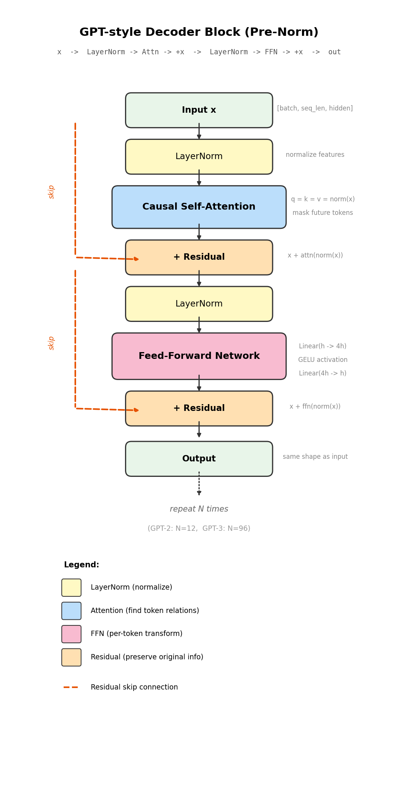
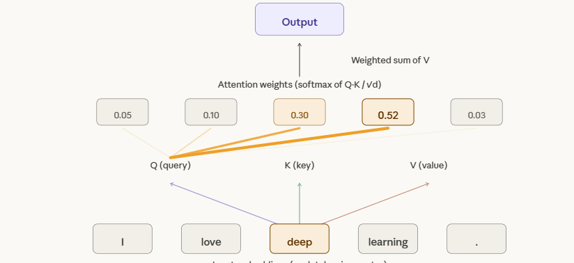
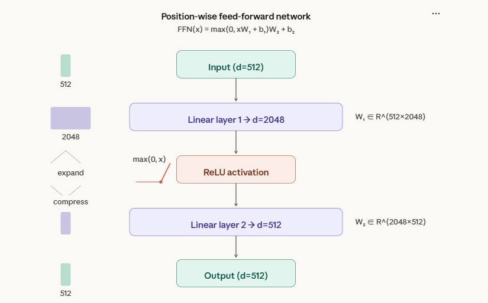

# 为什么现代 LLM 都用 Decoder-only：从推理效率说起

> 本文基于笔者在 RTX 4090 上对 GPT-2（124M）的真实 Profiling 数据，从推理效率角度解释 Decoder-only 为什么赢了。不讲玄学，只讲数据。

---

## 一、先搞清楚：Transformer 的三种架构

2017 年那篇改变世界的论文《Attention Is All You Need》提出了 Transformer，原始设计是 **Encoder-Decoder** 结构。但后来大模型的演化走出了三条路：

| 架构 | 代表模型 | 现状 |
|------|---------|------|
| Encoder-only | BERT | 做分类、做 embedding，不能生成文本 |
| Encoder-Decoder | T5、BART | 能用，但没人拿它做千亿参数大模型 |
| **Decoder-only** | **GPT、LLaMA、Claude** | **一统天下** |

为什么 Decoder-only 赢了？原因没你想的那么"学术"，更多是**工程和效率**的胜利。

---

## 二、60 秒搞懂 Decoder Block 长什么样

在讲推理效率之前，先看一眼 Decoder Block 的数据流——其实非常简单，就两步循环：



一个 Block 就做两件事：
1. **Attention**：看看其他 token 跟我有什么关系（但只能看前面的，不能偷看未来）
2. **FFN**：对每个 token 独立做一次"深度思考"

每步前面有 LayerNorm（归一化），后面有残差连接（加回原始输入）。GPT-2 叠 12 个这样的 Block，GPT-3 叠 96 个，就这么简单粗暴。

---

## 三、Attention 到底在干嘛？



简单说：对于句子 "I love deep learning."，当模型处理 "deep" 这个词时，Attention 会计算它和所有其他词的"关联度"——"deep" 和 "learning" 关联度 0.52（最高），和 "I" 只有 0.05。

**Decoder 的关键区别：Causal Mask**

Encoder（BERT）的 Attention 是双向的，每个词能看到所有其他词。但 Decoder 加了一个 **causal mask**——每个词只能看到前面的词，不能偷看后面的。

为什么？因为你在生成文本时，后面的词还没生成出来，当然不能看。这个约束听起来是个限制，但它恰恰是推理效率的关键——待会儿就知道了。

---

## 四、FFN：先放大再压缩的"思考空间"



FFN 做的事情很直觉：512 维 → 放大到 2048 维 → 激活 → 压回 512 维。

为什么要绕这么大一圈？类比：你写一篇 500 字的文章，先展开成 2000 字的草稿（把所有细节写上去），划掉没用的，再浓缩回 500 字精华。在高维空间里更容易把不同概念分开。

---

## 五、重头戏：推理的两个阶段

这才是 Decoder-only 胜出的核心原因。当你问 ChatGPT 一个问题时，推理分两个阶段：

### Prefill（预填充）

把你的 prompt 一次性**并行**喂进模型，算出所有 token 的 KV Cache。

这是一个大矩阵乘法（GEMM），GPU 最擅长的事。

### Decode（解码）

**一个一个**生成回答的 token。每生成一个，就要做一次完整的 forward pass。

这是矩阵×向量（GEMV），GPU 大部分时间在等数据从显存搬到计算单元。

```
Prefill:  [你的prompt所有token] → 一次性并行处理 → 得到 KV Cache
Decode:   逐个生成 token₁ → token₂ → token₃ → ... → 串行，无法并行
```

**类比：**
- Prefill 像考试时一次性读完题目（并行阅读）
- Decode 像手写答案，一个字一个字写（串行输出）

---

## 六、真实数据说话：Decode 占了 97%+ 的时间

我在 RTX 4090 Laptop GPU 上用 GPT-2（124M 参数）做了完整的 Profiling，结果如下：

| prompt 长度 | Prefill (ms) | Decode (ms) | 总耗时 (ms) | **Decode 占比** | Prefill 吞吐 | Decode 吞吐 |
|:---:|:---:|:---:|:---:|:---:|:---:|:---:|
| 32 tokens | 2.51 | 134.50 | 137.01 | **98.2%** | 12,771 tok/s | 476 tok/s |
| 64 tokens | 2.62 | 131.47 | 134.10 | **98.0%** | 24,390 tok/s | 487 tok/s |
| 128 tokens | 2.85 | 132.70 | 135.55 | **97.9%** | 44,850 tok/s | 482 tok/s |
| 256 tokens | 4.58 | 132.72 | 137.30 | **96.7%** | 55,947 tok/s | 482 tok/s |

> 测试条件：GPT-2 124M, RTX 4090 Laptop, FP32, 生成 64 tokens, 5 次取平均

三个令人震惊的数据：

**1. Decode 占了 97-98% 的时间**

你以为模型在"理解你的问题"花了很长时间？不，理解（prefill）只花了 2-4ms。它 97% 的时间都在一个字一个字地"写答案"。

**2. Prefill 吞吐量是 Decode 的 100 倍**

Prompt 从 32 → 256 tokens（8 倍），prefill 时间只从 2.5 → 4.6ms（不到 2 倍），吞吐量高达 55,947 tok/s。而 decode 不管 prompt 多长，都稳定在 ~482 tok/s。

为什么差 100 倍？因为 prefill 是并行矩阵乘法，GPU 的数千个核心全速运转；decode 每次只算一个 token，GPU 大部分核心都在摸鱼。

**3. Decode 的 per-token 时间恒定**

不管 prompt 是 32 还是 256，每个 decode token 都稳定在 2.07ms。瓶颈在显存带宽——每生成一个 token，都要把模型的全部权重从显存搬一遍。

---

## 七、CUDA Profiler 告诉我们的真相

用 `torch.profiler` 导出 Chrome trace 后，GPU 算子的时间分布：

| 算子 | CUDA 耗时占比 | 对应阶段 |
|------|:---:|------|
| `aten::addmm`（矩阵×矩阵） | **47.5%** | Prefill：大矩阵并行乘法 |
| `gemvx`（矩阵×向量） | **43.1%** | Decode：每次只乘一个向量 |
| `scaled_dot_product_attention` | 14.0% | Attention 计算 |
| `native_layer_norm` | 4.7% | LayerNorm 归一化 |

`addmm` 和 `gemvx` 加起来占了 **90.6%** 的 GPU 时间。这就是 Prefill（GEMM）和 Decode（GEMV）两种计算模式的直接体现。

---

## 八、所以 Decoder-only 为什么赢了？

现在你有数据了，答案就清晰了：

### 1. KV Cache：Decoder-only 的专属加速器

因为 Decoder 是单向的（只看前面的 token），所以之前算过的 Key 和 Value **可以缓存复用**：

```
生成 token 1: 算 Q₁, K₁, V₁            → 缓存 K₁, V₁
生成 token 2: 算 Q₂, K₂, V₂, 复用 K₁,V₁  → 缓存 K₁,V₁,K₂,V₂
生成 token 3: 算 Q₃, K₃, V₃, 复用之前全部  → 只需算新的一行
```

Encoder 的 Attention 是双向的——每个 token 都依赖所有其他 token，改了任何一个就要全部重算。**KV Cache 对 Encoder 无效。**

这意味着 Decoder-only 在 decode 阶段（占 97% 时间的瓶颈阶段）可以做增量计算，而 Encoder-Decoder 架构白白浪费了这个优化空间。

### 2. 训练数据：一个目标统一一切

Encoder-Decoder 的训练需要"输入-输出"配对数据（翻译对、摘要对），获取成本高。

Decoder-only 只做一件事：**预测下一个 token**。任何文本都是训练数据：

```
维基百科、代码、论文、Reddit、书籍... → 全部当作"预测下一个词"的练习
```

当 OpenAI 发现模型性能和数据量强相关（Scaling Law），Decoder-only 的数据获取成本优势就变成了碾压级别的。

### 3. Scaling Law 只在 Decoder-only 上被验证过

GPT-2（1.5B） → GPT-3（175B） → GPT-4（传闻 1.8T），每次 scale up 性能都在提升。这条路被反复验证是通的。

没有公司愿意花几亿美元去验证 Encoder-Decoder 能不能 scale 到同样规模——风险太大，而 Decoder-only 已经证明了自己。

---

## 九、那为什么你感觉 ChatGPT "想了一会儿"？

现在你知道了：prefill 只需要 2-4ms（对于 GPT-2），但你和 ChatGPT 对话时经常要等好几秒。

这不是 prefill 慢，而是：
1. **GPT-4 比 GPT-2 大 1000 倍以上**，prefill 和 decode 都更慢
2. **你的请求在排队**，等服务器空出显存给你
3. **Decode 是一个一个 token 生成的**，生成 500 个 token 就要 500 次 forward pass

这也是为什么 LLM 推理优化是一个价值千亿的领域：
- **KV Cache** → 减少 decode 时的重复计算
- **Flash Attention** → 减少显存搬运次数
- **量化 (INT8/INT4)** → 缩小模型体积，减少带宽瓶颈
- **Speculative Decoding** → 用小模型猜多个 token，减少 decode 步数
- **vLLM / PagedAttention** → 让 KV Cache 不浪费显存

每一项优化的目标都是同一个：**让 decode 阶段更快**，因为它占了 97% 的时间。

---

## 十、总结

| 维度 | Encoder-Decoder | Decoder-only |
|------|:---:|:---:|
| 训练数据 | 需要配对数据 | 互联网文本即可 |
| KV Cache | Encoder 部分无法缓存 | 全部可缓存 |
| Scaling 验证 | 未被验证 | GPT 系列反复验证 |
| 推理优化空间 | 有限 | KV Cache/量化/投机解码/vLLM |
| 工程复杂度 | Encoder + Decoder 两套 | 统一结构，更简单 |

Decoder-only 的胜出不是因为它理论上最优，而是它在**训练效率、推理效率、工程简洁性**三个维度上同时具有优势。当 Scaling Law 证明"大就是好"之后，谁能更高效地做大，谁就赢了。

这个答案不性感，但这就是工程的胜利。

---

*本文数据基于 GPT-2 (124M) 在 RTX 4090 Laptop GPU 上的实测 Profiling，代码和完整数据见 [GitHub](https://github.com/Richard0307/llm-inference-study)。*

*如果觉得有帮助，点个赞再走？*
